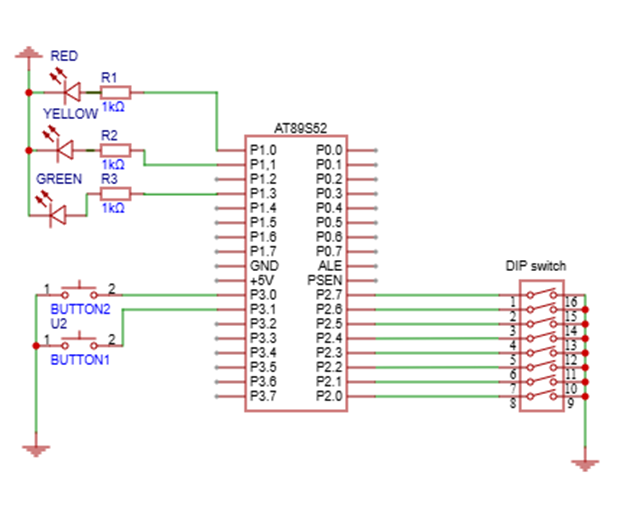
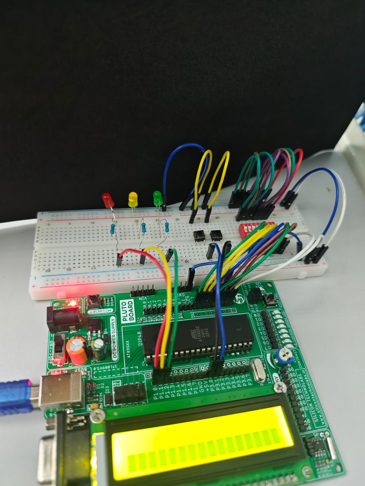
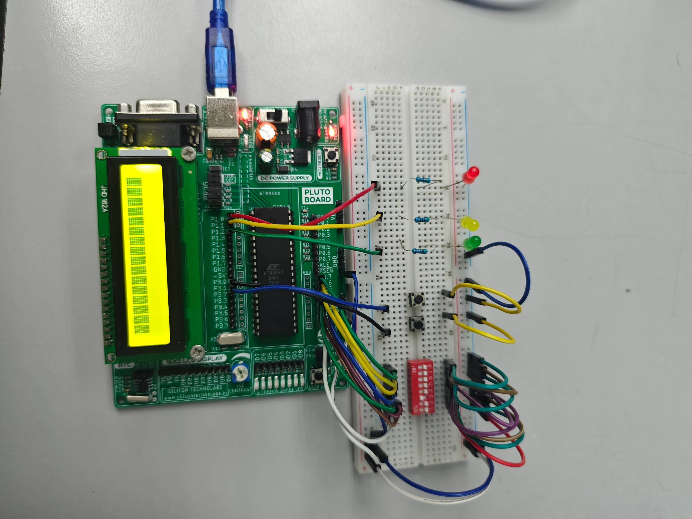
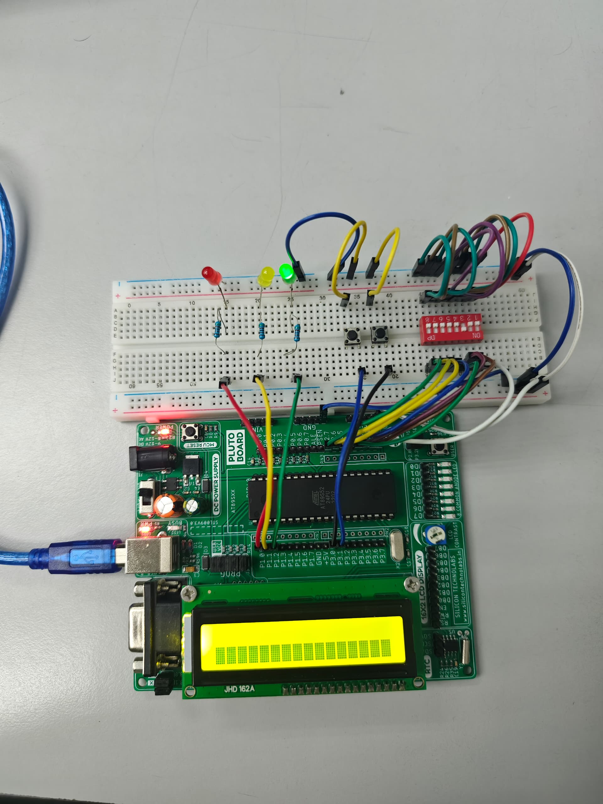

# 🔐 8051 Locking System Project

A password-protected electronic locking system implemented using the **8051 microcontroller**.  
The project simulates a lock/unlock mechanism with LEDs and switches using **MCU8051 IDE**.

---

## 🖼️ Circuit Diagram

---

## ⚙️ Explanation on Operation

This system is an electronic locking mechanism that uses LEDs and switches to simulate lock/unlock with password verification.

- **RESET State:**
  - Yellow LED lights up.
  - Reads password input from DIP switches.
  - Waits for the **Lock button (P3.0)**.  
  

- **LOCKED State:**
  - Red LED lights up.
  - Waits for the **Unlock button (P3.1)**.
  - If pressed → checks password.  
  

- **CHECKPASSWORD State:**
  - Compares input (`P0`) with stored password (`P2`).
  - If match → go to **UNLOCKED**.
  - If mismatch → go to **BLINK**.  

- **UNLOCKED State:**
  - Green LED lights up.
  - Waits for further lock/unlock actions.  
  

- **BLINK State:**
  - Red LED blinks 3 times to indicate wrong password.
  - Returns to LOCKED state.  

- **DELAY Subroutine:**
  - Provides timing control for blinking and input stability.

---

## 📝 Design Considerations & Limitations

**Design Considerations**
- Uses simple and cost-effective **8051 microcontroller**.
- LED indicators for clear state feedback.
- DIP switches for flexible password input.
- Tactile switches simulate real lock/unlock buttons.
- Delay routine ensures stable operation.

**Limitations**
- Password limited by available DIP switches.
- No encryption → password is exposed.
- Only supports **single-user password**.
- System uses finite states → not easily scalable.
- Dependent on correct hardware configuration.

---

## 📜 Acknowledgement
This project was completed as part of **WIX1003 Computer System Organization** coursework (Semester 1, 2024/2025).

---

## 👥 Contributors
- **WONG WEI LI**   
- **TENG WEN HONG** 
